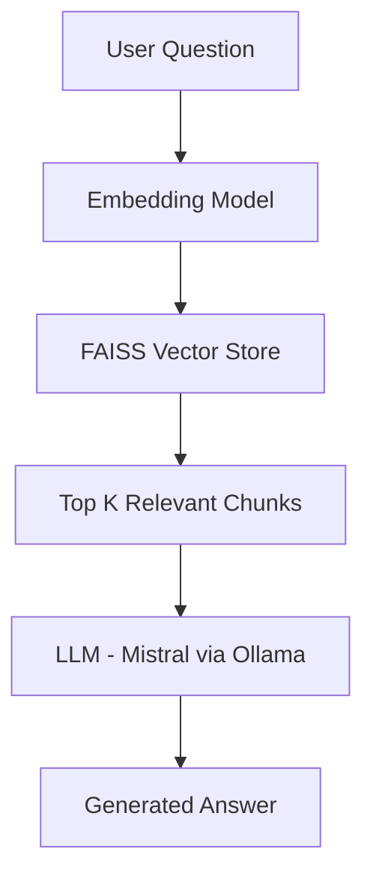

# Enterprise RAG API


A modular **Retrieval-Augmented Generation (RAG)** system for answering industrial maintenance questions using a local LLM, FAISS vector search, and FastAPI.

This project demonstrates how to build a complete RAG pipeline including:

- document ingestion
- semantic vector indexing
- retrieval
- LLM-based answer generation
- evaluation of system responses

---

## Architecture



---

## Tech Stack

- Python
- FastAPI
- FAISS
- LangChain
- Sentence Transformers
- Ollama (local LLM runtime)
- Docker
- Uvicorn

---

## Project Structure

```text
enterprise-rag
│
├── app
│ ├── server.py
│ ├── ask.py
│ ├── build_index.py
│ └── cli.py
│
├── data
│ └── sample.txt
│
├── vectorstore
│ └── faiss_index
│
├── tests
│ └── evaluate_rag.py
│
├── images
│ ├── api_example-1.png
│ ├── api_example-2.png
│ ├── api_example-3.png
│ └── evaluation.png
│
├── Dockerfile
├── docker-compose.yml
├── requirements.txt
└── README.md

```

---

## API Documentation

The API is automatically documented using FastAPI Swagger UI.

Swagger UI:

```bash
http://localhost:8000/docs
```

---

## Example API Request

```bash
curl -X POST http://localhost:8000/ask \
-H "Content-Type: application/json" \
-d '{"question":"What is preventive maintenance?"}'
```

Example response:

```json
{
  "question": "...",
  "answer": "..."
}
```

---

## Evaluation

A simple evaluation script is included to test the RAG pipeline.

Run:

```bash
python tests/evaluate_rag.py
```

### The script sends sample questions to the API and reports:

   - generated answers

   - response latency

### Hardware used for evaluation:

   - CPU-only inference

   - Model: Mistral (Ollama)

   - Embedding: sentence-transformers/all-MiniLM-L6-v2

   - Vector store: FAISS

Example output:


---

## Setup

### Clone the repository:

```bash
git clone <repo-url>
cd enterprise-rag
```

### Create virtual environment:

```bash
python -m venv venv
source venv/bin/activate
```

### Install dependencies:

```bash
pip install -r requirements.txt
```

---

## Start Ollama

Make sure Ollama is running before starting the API.

```bash
ollama serve
ollama pull mistral
```

--- 

## Build Vector Index

```bash
 python app/build_index.py
```

---

## Run the API

```bash
uvicorn app.server:app --reload
```

API endpoint:

```bash
http://localhost:8000
```

Swagger docs:

```bash
http://localhost:8000/docs
```

---

## Future Improvements

   - RAG evaluation metrics (RAGAS)

   - Hybrid retrieval

   - Caching layer

   - GPU inference support

---

