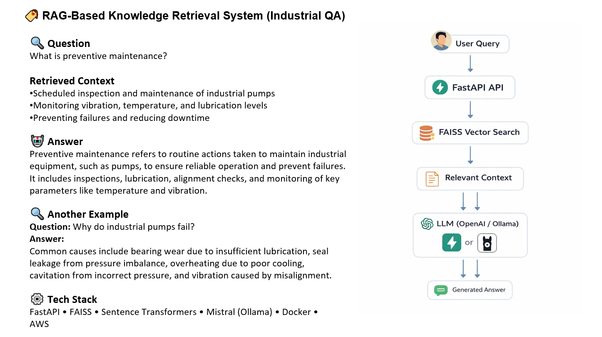
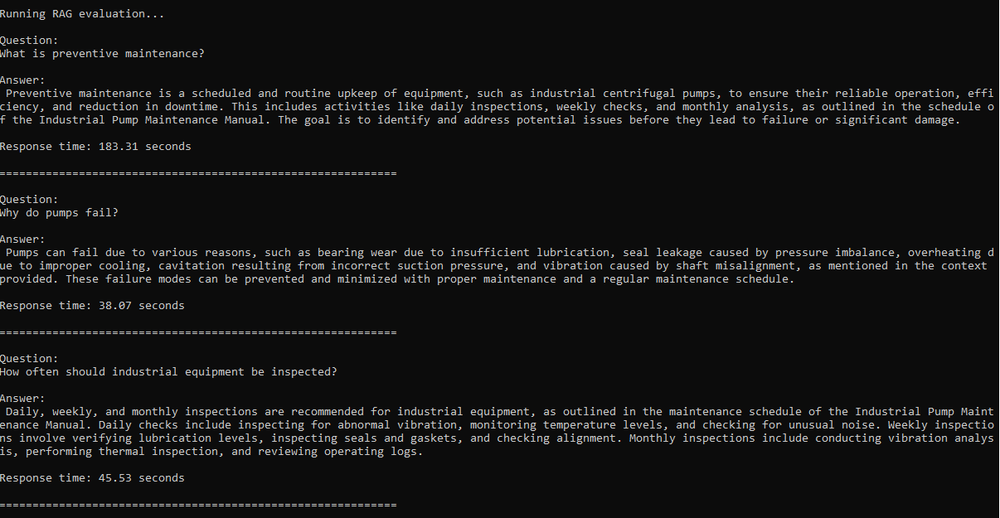

# Enterprise RAG API


A modular **Retrieval-Augmented Generation (RAG)** system built with FastAPI, FAISS vector search, and configurable LLM providers (OpenAI or Ollama).



## Overview

This project demonstrates how to build a complete RAG pipeline including:

- document ingestion
- semantic vector indexing
- retrieval
- LLM-based answer generation
- evaluation of system responses

The system is designed with a provider abstraction layer, allowing easy switching between cloud LLMs and local models via environment variables.

---

## Architecture

```
                +-------------------+
                |    User Query     |
                +---------+---------+
                          |
                          v
                +-------------------+
                |    FastAPI API    |
                +---------+---------+
                          |
                          v
                +-------------------+
                |   FAISS Retrieval |
                |   (Vector Search) |
                +---------+---------+
                          |
                          v
                +-------------------+
                |  Relevant Context |
                +---------+---------+
                          |
                          v
                +-------------------+
                |    LLM Provider   |
                |                   |
                |  OpenAI / Ollama |
                +---------+---------+
                          |
                          v
                +-------------------+
                |  Generated Answer |
                +-------------------+
                
``` 

---

## Features

   - Retrieval-Augmented Generation (RAG)

   - FAISS vector search

   - HuggingFace sentence-transformer embeddings

   - OpenAI support

   - Ollama local model support

   - LLM provider abstraction layer

   - FastAPI REST API

   - Docker & Docker Compose support

   - Evaluation script for testing the RAG pipeline

   - Deployable on AWS EC2

---

## Project Structure

```text
enterprise-rag
│
├── app
│   ├── server.py
│   ├── ask.py
│   ├── build_index.py
│   ├── cli.py
│   └── llm
│       └── provider.py
│
├── data
│   └── sample.txt
│
├── vectorstore
│   └── faiss_index
│
├── tests
│   └── evaluate_rag.py
│
├── images
│   └── evaluation.png
│
├── Dockerfile
├── docker-compose.yml
├── start.sh
├── requirements.txt
└── README.md

```

---

## Setup

### Clone the repository:

```bash
git clone <repo-url>
cd enterprise-rag-api
```

### Create environment variables:

```bash
cp .env.example .env
```
Edit `.env` and add your OpenAI key if needed.

### Running locally
Activate the virtual environment:

```bash
source venv/bin/activate
```

### Install dependencies:

```bash
pip install -r requirements.txt
```

---

#### Start Ollama (Optional)

If using local models, make sure Ollama is running:

```bash
ollama run mistral
```

--- 

### Build the FAISS index:

```bash
python app/build_index.py
```

### Start the API:

```bash
uvicorn app.server:app --reload
```

API will be available at:

```bash 
http://localhost:8000
```

Interactive API docs:

```bash
http://localhost:8000/docs
```

---

## Example API Request

```bash
curl -X POST http://localhost:8000/ask \
-H "Content-Type: application/json" \
-d '{"question":"What is preventive maintenance?"}'
```

Example response:

```json
{
  "question": "...",
  "answer": "..."
}
```

---

## Running with Docker

Build and start the container:

```bash 
docker compose up --build
```

The API will be available at:

```bash
http://localhost:8000
```

Swagger documentation:

```bash
http://localhost:8000/docs
```

---

## Deployment (AWS EC2)

This project can be deployed on AWS EC2 using Docker.

Example steps:

```bash
git clone https://github.com/Khojasteh-hb/enterprise-rag-api.git
cd enterprise-rag-api

cp .env.example .env
```

Configure `.env`:

```bash
LLM_PROVIDER=openai
OPENAI_API_KEY=your_api_key
```

Start the service:

```bash
docker compose up -d --build
```

Access the API:

```bash
http://EC2_PUBLIC_IP:8000/docs
```

---

## Evaluation

A simple evaluation script is included to test the RAG pipeline.

Run:

```bash
python tests/evaluate_rag.py
```

The script sends sample questions to the API and reports:

   - generated answers

   - response latency

### Hardware used for evaluation:

   - CPU-only inference

   - LLM: Mistral (Ollama) or OpenAI models

   - Embedding: `sentence-transformers/all-MiniLM-L6-v2`

   - Vector store: FAISS

Example output:


---

## LLM Providers

The system supports multiple LLM providers configured via environment variables.

### OpenAI

```bash
LLM_PROVIDER=openai
OPENAI_API_KEY=your_key
```

### Ollama

```bash
LLM_PROVIDER=ollama
OLLAMA_BASE_URL=http://host.docker.internal:11434
```

---

## Environment Variables

Example `.env` configuration:

```env
LLM_PROVIDER=openai
OPENAI_API_KEY=your_api_key

# optional for Ollama
OLLAMA_BASE_URL=http://host.docker.internal:11434
```

---

## Future Improvements

   - Hybrid search (BM25 + vector search)

   - Streaming responses

   - RAG evaluation metrics

   - Improved prompt engineering

   - Web chat interface

   - Observability and logging

---

## License

MIT License

---
